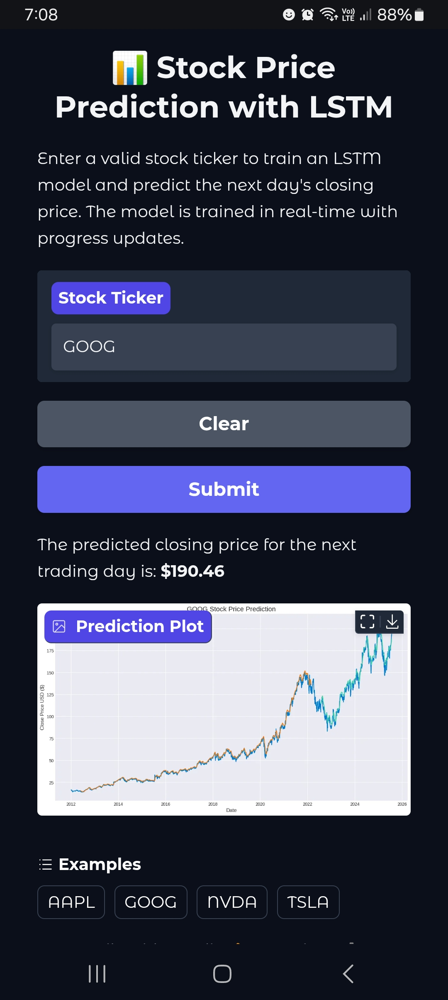

# 📈 Stock Price Prediction using LSTM (Live Training with Gradio)

This project is an interactive web application built with **Gradio** that uses an **LSTM (Long Short-Term Memory)** model to predict future stock prices. It fetches real-time stock data using **Yahoo Finance**, preprocesses the data, trains an LSTM model, and predicts the **next trading day's closing price**, all with **live training progress visualization** in the UI.

---

## 🚀 Features

- 📊 **Real-time Stock Data** from [Yahoo Finance](https://finance.yahoo.com/)
- 🤖 **LSTM Neural Network** implemented using Keras & TensorFlow
- 📈 **Next-Day Price Prediction** with visual plots
- 📉 **Train/Test Split Visualization**
- 🌐 **Interactive Web UI** using [Gradio](https://gradio.app/)
- 📦 **Live Progress Bar** with epoch-wise updates during model training

---

## 🔧 How It Works

1. Enter a **valid stock ticker** (e.g., `AAPL`, `GOOG`, `TSLA`).
2. The app fetches **historical stock prices** from 2012 to current date.
3. Data is **scaled**, **windowed**, and split into **training** and **test** datasets.
4. A custom LSTM model is **trained live** (15 epochs).
5. The model **predicts** and **plots** the stock trend.
6. The **next day's predicted price** is displayed.

---

## 🧠 Technologies Used

- `Python`
- `Gradio` for UI
- `TensorFlow & Keras` for LSTM
- `yfinance` for stock data
- `Matplotlib` for plotting
- `Scikit-learn` for scaling
- `NumPy` & `Pandas` for data handling
